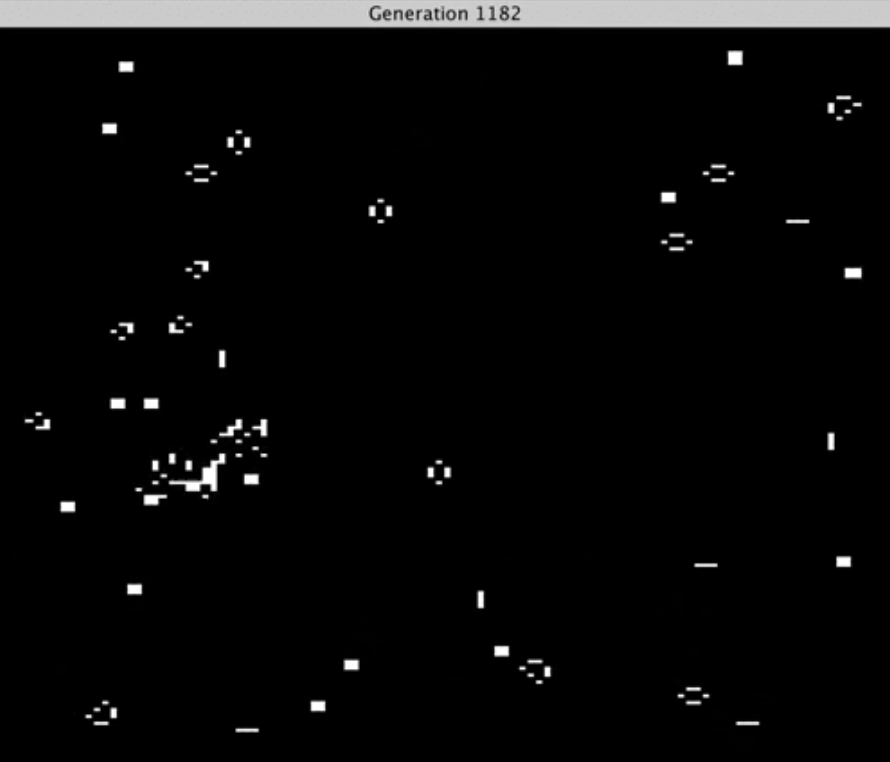

# Specification

## Functional Requirements

The user will perform the following steps to use the program.
1. Install the program by compiling it.
1. Run the executable.
1. The following prompts will take place in the console.
    1. `Enter "s" to supply a seed ("r" for random): `
        - If a seed is to be supplied:
            1. `Enter the number of columns ("r" for random): `
            
                The number of columns is an integer in the range of one and infinity.
            1. `Enter the seed using "A" for alive cells, and "D" for dead ones (e.g., "ADDADD" has two rows if you specified the seed should have three columns earlier): `
        - If a random seed is chosen:
            1. `Enter the number of rows, or "r" for a random amount: `
        
                The number of rows is an integer in the range of one and infinity.
            1. `Enter the number of columns ("r" for random): `
    
                The number of columns is an integer in the range of one and infinity.
1. See the chart that popped up, which will look like 

## Technical Requirements

- Programming language: Kotlin
- Build tool: Gradle
- GUI: [XChart](https://github.com/knowm/XChart)
- Unit tests: JUnit 5